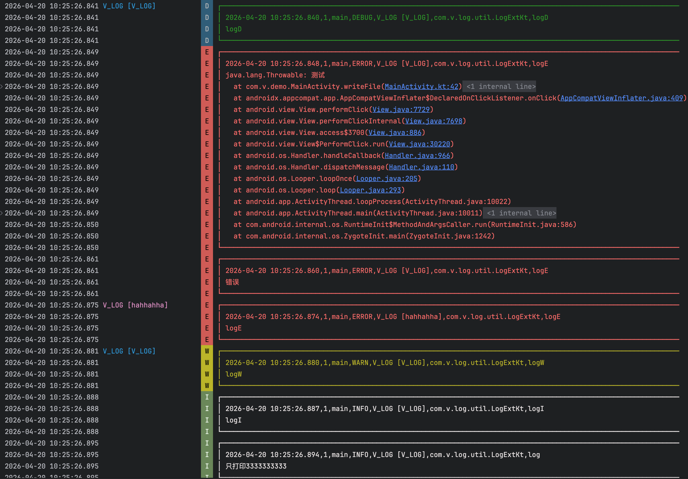
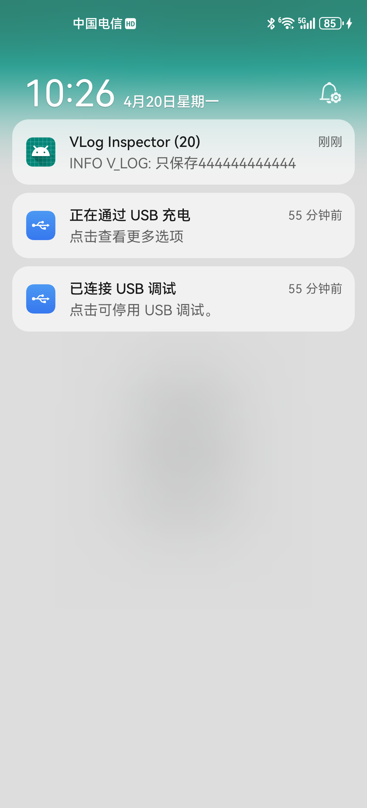
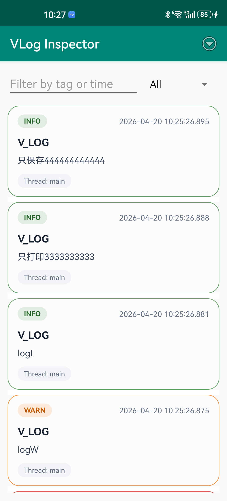
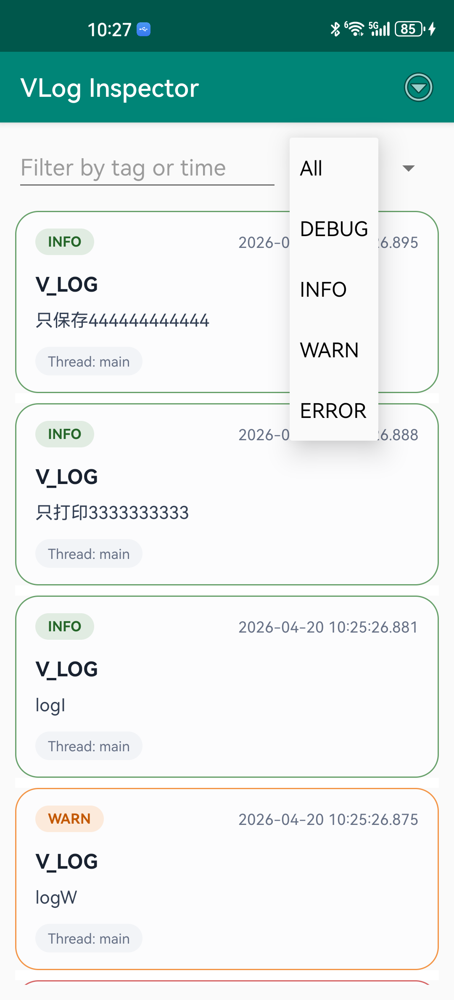
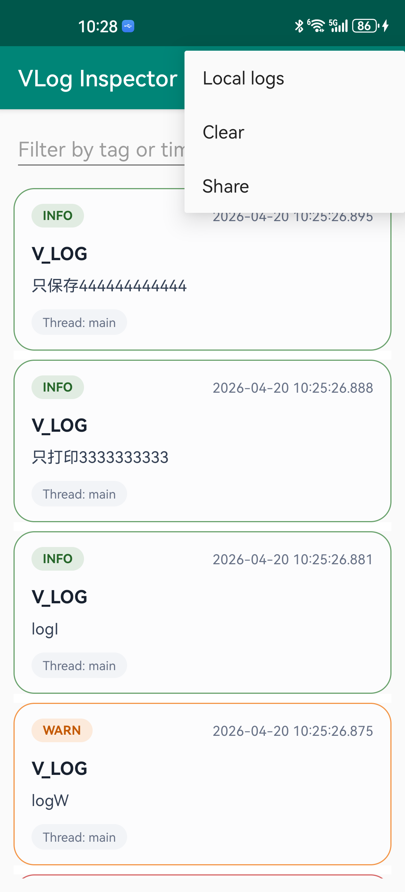
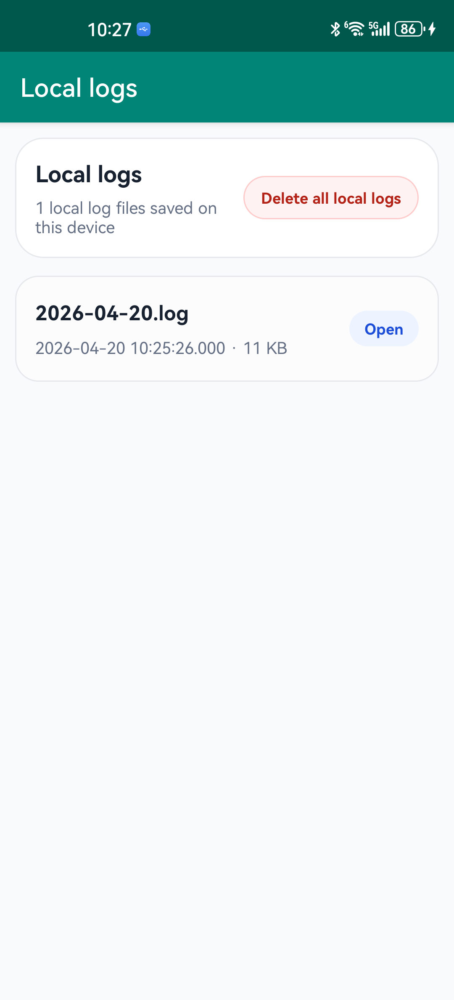

# 日志系统框架

VLog 是一个基于mmap， 高性能，高可用的，无丢失的，简单易用的日志系统框架。
sdcard/Android/data/
## 特性介绍  

| 特性|简介|
| ------ | ------ |
|自定义日志保存路径 |默认保存在Android/data/com.xxxx.xxxx/files/log中|
|自定义日志缓存路径|默认保存在Android/data/com.xxxx.xxxx/files/cache中|
|自定义日志最大容量|默认70M，超过最大容量就不再写入|
|日志按天保存，自定义日志保存天数|默认保存最近7天的日志，超过七天的日志将会被删除|
|自定义日志加密方式|默认不加密，可以实现LogEncrypt接口，实现自定义的加密方式|
|日志记录通用信息|在日志系统初始化的时候，会一并记录App版本，手机型号等信息，网络切换的时候还会记录网络类型|
|日志格式为CSV格式，方便后端解析展示|写日志的时候，会同时写入当前时间，线程ID，线程的名字，Log等级，以及当前所在类和方法的名字|
|支持控制台打印日志信息|在写入日志到本地的同时，也会在控制台输出相应的日志信息|
|全新优化的日志展示体验，更清晰直观|
|无需连接设备即可实时查看日志|
|支持历史日志查看与回溯|
|支持日志一键分享与导出|

### 优美的日志输出


### 无需连接设备即可实时查看日志





### 历史日志查看与回溯



## 添加依赖

1. 在项目根目录的build.gradle 中添加:

   ```groovy
   	allprojects {
   		repositories {
   			...
   			maven { url 'https://jitpack.io' }
   		}
   	}
   ```

2. 添加依赖

   ```groovy
   dependencies {
   	        implementation 'com.github.oooo7777777:Vlog:2.0.0'
   	}
   ```

## 初始化
```
//初始化日志系统
 VLog.init(
            LogConfig(this, BuildConfig.DEBUG, true)
                .setEnableLogInspector(true)
        )
```

## 打印日志(推荐使用kotlin方法)

```
kotlin
"hello VLog".logI()

java
LogExtKt.log("hello VLog");
```

## 立即写入到文件，在上传日志的时候调用

```
VLog.flush();
```


